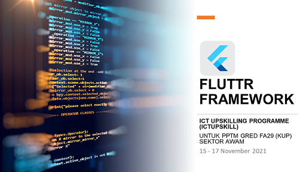

# Hari 1
- Pengenalan kepada Mobile Platorm
- Apa itu Flutter Framework
- Pemasangan persekitaran Flutter, Android SDK & VSCode IDE
- Widget Layout & UI Element

## Latihan 1

Menghasilkan projek flutter dengan penerangan kerangka asas Flutter

- StatelessWidget
- MaterialApp
- Scaffold

Latihan 1 : [flutter_application_1](https://github.com/mzm-dev/upskill-flutter/tree/main/flutter_projek/flutter_application_1)

## Latihan 2

Merangka Layout berasaskan **Column** dan **Row** bagi membentuk satu susunan _layout_ yang dikehendaki didalam antaramuka aplikasi

- StatelessWidget
- MaterialApp
- Scaffold
- Widget Column and children
- Widget Row and children
- Widget Container and child   


Latihan 2 : [flutter_application_2](https://github.com/mzm-dev/upskill-flutter/tree/main/flutter_projek/flutter_application_2)


## Latihan 3
Melengkapkan Layout **Column** dan **Row** dengan kandungan seperti Widget Text & Image untuk menghasilkan aplikasi lebih menarik

Mewujudkan fail ```home.dart``` yang berasingan bagi penyusunan struktur projek 

- Widget Column and children
- Widget Row and children
- Widget Container and child 
  - Widget Center
  - Widget Text
  - Widget Image  

**double? width**
```MediaQuery.of(context).size.width``` 

**double? height**
```MediaQuery.of(context).size.height```


  
Latihan 3 : [flutter_application_3](https://github.com/mzm-dev/upskill-flutter/tree/main/flutter_projek/flutter_application_3)
