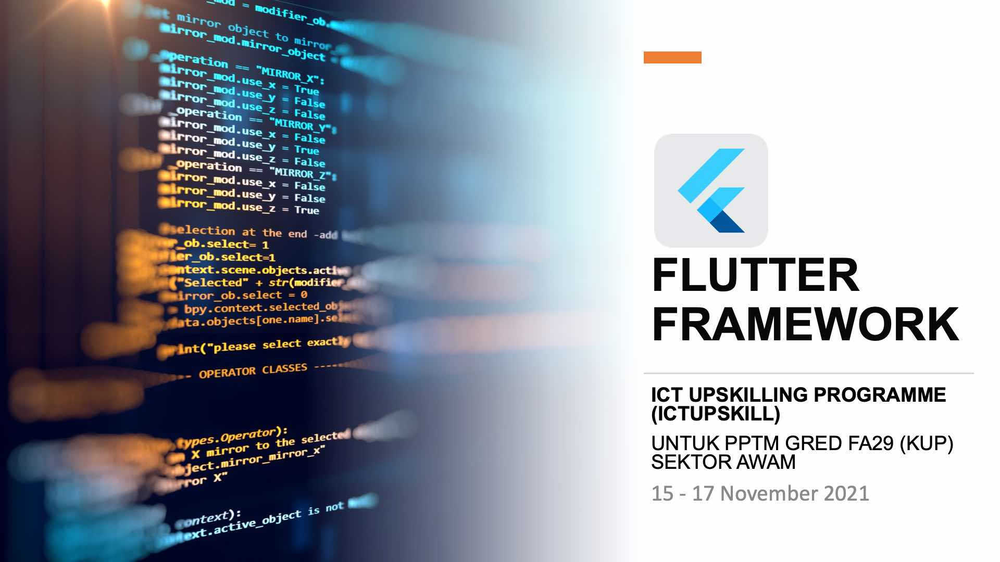
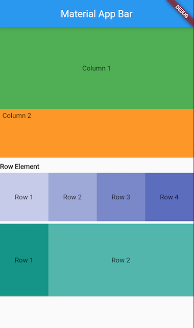
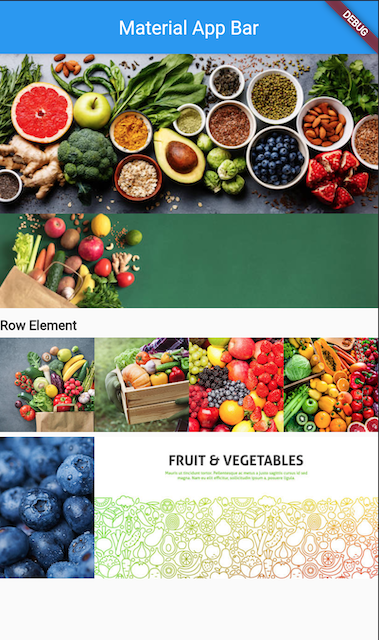

- Pengenalan kepada Mobile Platorm [(Slide)](https://github.com/mzm-dev/upskill-flutter/blob/main/slide-Flutter.pdf)
- Apa itu Flutter Framework
- Pemasangan persekitaran Flutter, Android SDK & VSCode IDE
- Widget Layout & UI Element

## Latihan 1

Menghasilkan projek flutter dengan penerangan kerangka asas Flutter

- StatelessWidget
- MaterialApp
- Scaffold

### StatelessWidget
```dart
import 'package:flutter/material.dart';

void main() => runApp(MyApp());

class MyApp extends StatelessWidget {
  @override
  Widget build(BuildContext context) {
    return MaterialApp(
      title: 'Material App',
      home: Scaffold(
        appBar: AppBar(
          title: Text('Material App Bar'),
        ),
        body: Center(
          child: Container(
            child: Text('Hello World'),
          ),
        ),
      ),
    );
  }
}
```

### StatefulWidget
```dart
import 'package:flutter/material.dart';

void main() => runApp(MyApp());

class MyApp extends StatefulWidget {
  @override
  State<MyApp> createState() => _MyAppState();
}

class _MyAppState extends State<MyApp> {
  @override
  Widget build(BuildContext context) {
    return MaterialApp(
      title: 'Material App',
      home: Scaffold(
        appBar: AppBar(
          title: Text('Material App Bar'),
        ),
        body: Center(
          child: Container(
            child: Text('Hello World'),
          ),
        ),
      ),
    );
  }
}
```

Latihan 1 : [flutter_application_1](https://github.com/mzm-dev/upskill-flutter/tree/main/flutter_projek/flutter_application_1)

## Latihan 2

Merangka Layout berasaskan **Column** dan **Row** bagi membentuk satu susunan _layout_ yang dikehendaki didalam antaramuka aplikasi



- StatelessWidget
- MaterialApp
- Scaffold
- Widget Column and children
- Widget Row and children
- Widget Container and child   


Latihan 2 : [flutter_application_2](https://github.com/mzm-dev/upskill-flutter/tree/main/flutter_projek/flutter_application_2)


## Latihan 3
Melengkapkan Layout **Column** dan **Row** dengan kandungan seperti Widget Text & Image untuk menghasilkan aplikasi lebih menarik



Mewujudkan fail ```home.dart``` yang berasingan bagi penyusunan struktur projek 

- Widget Column and children
- Widget Row and children
- Widget Container and child 
  - Widget Center
  - Widget Text
  - Widget Image  
  - Dependencies : images
- Navigator push and pop

**double? width**
```MediaQuery.of(context).size.width``` 

**double? height**
```MediaQuery.of(context).size.height```


  
Latihan 4 : [flutter_application_3](https://github.com/mzm-dev/upskill-flutter/tree/main/flutter_projek/flutter_application_4)

## Latihan 4

Mewujudkan fail ```show.dart``` untu memaparkan butiran dari ```home.dart```
- Dependencies : fonts
  - ```fontFamily: 'Bubblegum'```
- Navigator push and pop
  - Widget InkWell  
- Data Model
- ListView Builder
- UI Element ```ListTile()```

**Custom Widget : KlikGambarWidget()**
```dart
class KlikGambarWidget extends StatelessWidget {
  KlikGambarWidget({
    Key? key,
    required this.title,
    required this.nama,
  }) : super(key: key);

  String title;
  String nama;

  @override
  Widget build(BuildContext context) {
    return InkWell(
      onTap: () {
        Navigator.push(
            context,
            MaterialPageRoute(
                builder: (context) => ShowPage(gambar: nama, title: title)));
      },
      child: Container(
        height: 100,
        width: MediaQuery.of(context).size.width * 0.25,
        decoration: BoxDecoration(
            image: DecorationImage(
                image: AssetImage('images/$nama'), fit: BoxFit.cover)),
      ),
    );
  }
}
```
**Data Models**

```dart
class Gambar {
  String gambar;
  String tajuk;

  Gambar({required this.gambar, required this.tajuk});
}
```

**Data List<Gambat>**
```dart
List<Gambar> semua = [
  Gambar(gambar: 'avatar/avatar1.png', tajuk: 'Avatar 1'),
  Gambar(gambar: 'avatar/avatar2.png', tajuk: 'Avatar 2'),
  Gambar(gambar: 'avatar/avatar3.png', tajuk: 'Avatar 3'),
  Gambar(gambar: 'avatar/avatar4.png', tajuk: 'Avatar 4'),
  Gambar(gambar: 'avatar/avatar5.png', tajuk: 'Avatar 5'),
];

```

  
Latihan 4 : [flutter_application_4](https://github.com/mzm-dev/upskill-flutter/tree/main/flutter_projek/flutter_application_4)

## Latihan 5

Membina ```Drawer()``` (side bar) dan simpan sebagai widgets/menu.dart

```dart
  import 'package:flutter/material.dart';
import 'package:flutter_application_4/pages/home.dart';
import 'package:flutter_application_4/pages/list.dart';
import 'package:flutter_application_4/pages/listdata.dart';

class MenuWidget extends StatelessWidget {
  const MenuWidget({
    Key? key,
  }) : super(key: key);

  @override
  Widget build(BuildContext context) {
    return Drawer(
      child: ListView(
        children: [
          Container(
            padding: EdgeInsets.symmetric(horizontal: 5.0),
            width: MediaQuery.of(context).size.width,
            height: 80,
            alignment: Alignment.centerRight,
            decoration: BoxDecoration(
                image: DecorationImage(
                    image: AssetImage('images/fruit/fruit_main.jpg'),
                    fit: BoxFit.cover)),
            child: const Text('Fruit App',
                style: TextStyle(
                    color: Colors.white,
                    fontSize: 24,
                    letterSpacing: 3.5,
                    fontWeight: FontWeight.bold,
                    fontFamily: 'Bubblegum')),
          ),
          ListTile(
            leading: Icon(Icons.home),
            title: Text('Home'),
            onTap: () {
              //Navigator
              Navigator.push(
                  context, MaterialPageRoute(builder: (context) => Home()));
            },
          ),
          ListTile(
            leading: Icon(Icons.favorite),
            title: Text('My Fruit'),
            onTap: () {
              //Navigator
              Navigator.push(
                  context, MaterialPageRoute(builder: (context) => ListPage()));
            },
          ),
          ListTile(
            leading: Icon(Icons.batch_prediction),
            title: Text('Fruit Data'),
            onTap: () {
              //Navigator
              Navigator.push(context,
                  MaterialPageRoute(builder: (context) => ListDataPage()));
            },
          ),
        ],
      ),
    );
  }
}
```  


Menghasilkan AppBar action button utk ```LoginPage()```  
  - Widget Form()
  - Widget TextFormField()
  - Widget ElevatedButton()
  
Mengubah App icon launcher menggunakan plugin https://pub.dev/packages/flutter_launcher_icons
  
```dart
  flutter_launcher_icons: ^0.9.2  

  flutter_icons:
    android: "launcher_icon"
    ios: true
    image_path: "images/icon/logo.png"
```
``` 
  flutter pub run flutter_launcher_icons:main 
```  
In the above configuration, the package is setup to replace the existing launcher icons  

Menghasilkan apk dengan CLI ```flutter build apk```  
  
Latihan 5 : [flutter_application_5](https://github.com/mzm-dev/upskill-flutter/tree/main/flutter_projek/flutter_application_5)

# Rujukan
- [Flutter Icon](https://fonts.google.com/icons?selected=Material+Icons)
- [Flutter Flow](https://flutterflow.io/index.html)
